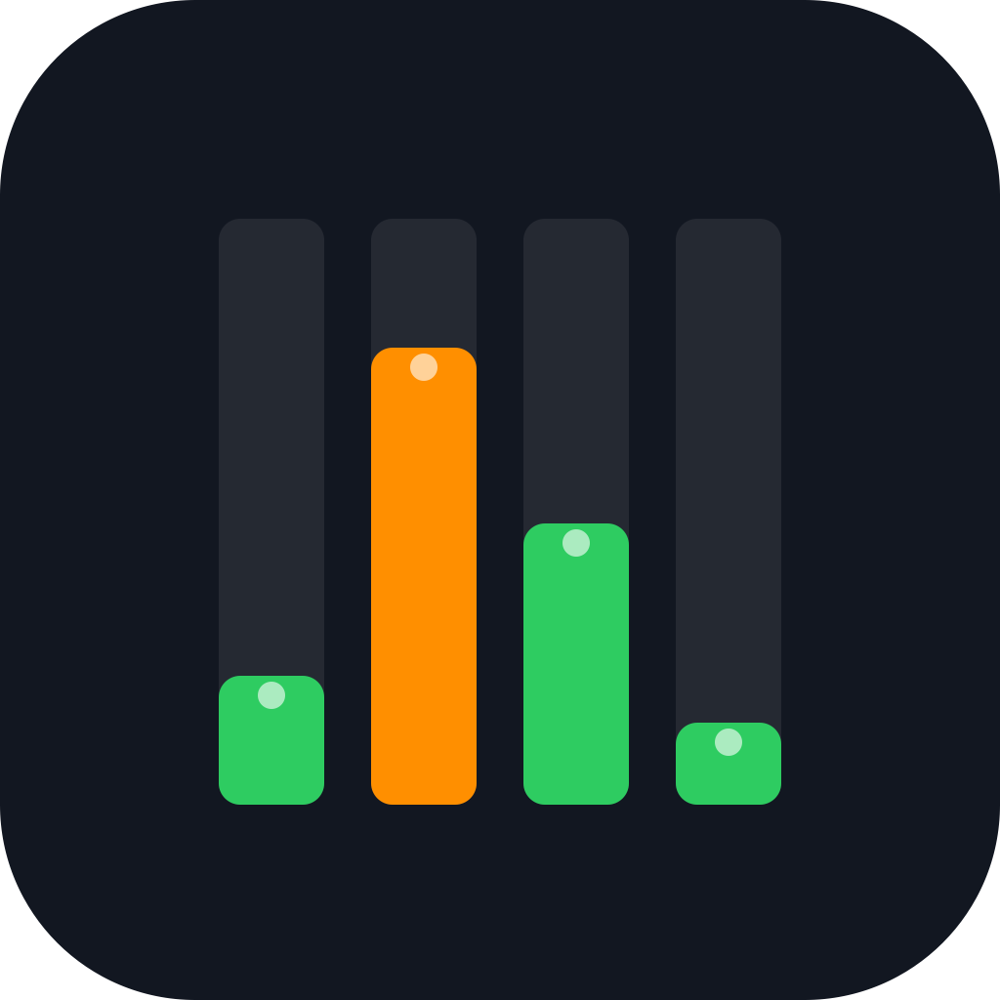

# ClaudeUsagePulse



A lightweight native macOS menu bar app that shows your [Claude.ai](https://claude.ai) usage limits in real time — no browser tab needed.


---

## Features

- **Lives in your menu bar** — always visible, zero distraction
- **5 usage metrics**: Session (5h), Weekly (7d), Sonnet-only, Claude Design, API Credits
- **Configurable slots** — choose which 2 metrics appear in the top and bottom row
- **Optional background** with custom color and opacity for readability on any desktop
- **Floating window** — bars or circles view with reset countdowns
- **Auto-refresh** at configurable intervals (5 / 10 / 15 / 30 min)
- **Secure** — session cookies stored in macOS Keychain, all requests go directly to `claude.ai`
- **Launch at login** support

---

## Requirements

- macOS 14 (Sonoma) or later
- An active [Claude.ai](https://claude.ai) account (Pro, Team or Enterprise)

---

## Installation

### Download (recommended)

1. Download `ClaudeUsagePulse.dmg` from the [latest release](https://github.com/CrazyJack78/ClaudeUsagePulse/releases/latest)
2. Open the DMG and drag **ClaudeUsagePulse.app** to your Applications folder
3. Launch the app — macOS may block it on first open since it is not notarized
4. If Gatekeeper blocks it, run once in Terminal:
   ```bash
   sudo xattr -rd com.apple.quarantine /Applications/ClaudeUsagePulse.app
   ```

### Build from source

```bash
git clone https://github.com/CrazyJack78/ClaudeUsagePulse.git
cd ClaudeUsagePulse
bash build.sh          # builds, signs (ad-hoc) and installs to /Applications
```

Requires Xcode Command Line Tools (`xcode-select --install`).

---

## Usage

1. Launch **ClaudeUsagePulse**
2. Click **"Anmelden"** in the menu bar to log in with your Claude.ai account
3. After login the app shows your current usage — e.g. `Se 20% / We 2%`
4. **Left-click** the menu bar item: toggles the floating window (if enabled in Settings)
5. **Right-click**: opens the context menu with quick stats, manual refresh and Settings

---

## Settings

Open **Settings** via right-click → *Einstellungen…*

| Setting | Description |
|---|---|
| **Upper / Lower slot** | Which metric to show in each row of the menu bar |
| **Background** | Toggle dark pill background; pick any color + opacity |
| **Window style** | Bars (all metrics) or Circles (selected slots) |
| **Always on top** | Floating window stays above other windows |
| **Refresh interval** | How often usage data is fetched |
| **Launch at login** | Start automatically on login |

---

## Privacy

- No telemetry, no analytics, no third-party services
- Session cookies are stored only in your local macOS **Keychain**
- All API calls are made directly to `claude.ai` using your existing browser session

---

## Contributing

Pull requests and issues are welcome. Please open an issue first for larger changes.

---

## License

[MIT](LICENSE) — © 2026 Jack
